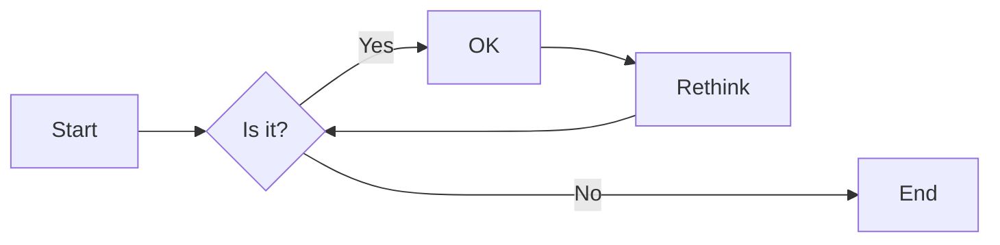
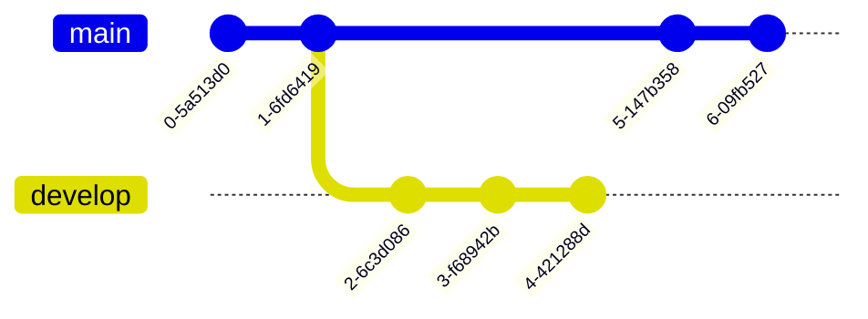
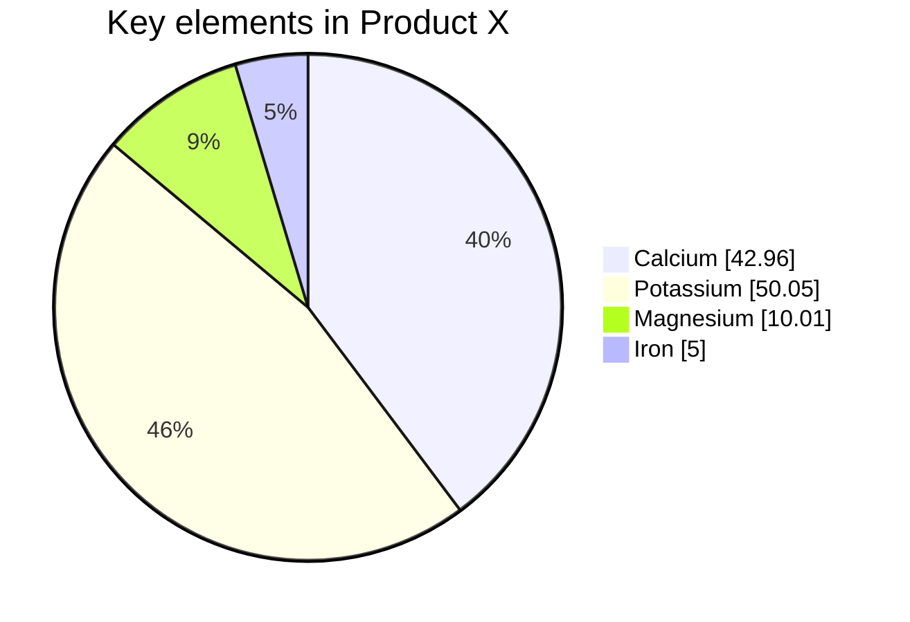
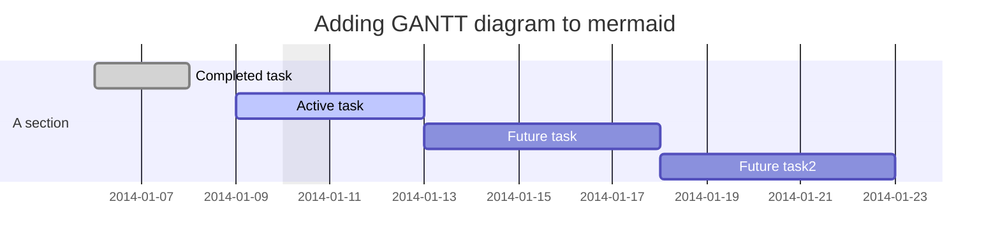

# Guía practica Markdown.

## Sintaxis básica:
- [ \# ] Símbolo de numeral
- [ \* ] Asterisco <- usemos este
- [ \_ ] Guion bajo
- [ *,-, +, 1 ] Para listas uno de estos símbolos seguido de un punto
- [ ***, ---, ___ ] Para mostrar un linea divisoria
- Formato de un link: \[ texto ]( https://github.com/ )
- Formato para incluir imágenes \!\[]( README_img/template-SAM-CloudFormation-2022-08-11_06-52-21.png )

### Ejemplos

#### Párrafo
Culpa reprehenderit aliqua in tempor voluptate esse ea enim eiusmod dolore anim nostrud.
Texto luego de salto de linea tipo **\<br>** en HTML

Culpa reprehenderit aliqua in tempor voluptate esse ea enim eiusmod dolore anim nostrud.

#### Itálica
*Culpa reprehenderit* aliqua in tempor voluptate esse ea enim eiusmod dolore anim nostrud.

#### Negrita
**Culpa reprehenderit** aliqua in tempor voluptate esse ea enim eiusmod dolore anim nostrud.

#### Negrita cursiva
Cómo seria????

#### Mostrar imagen


#### Bloque
> Consectetur culpa dolor do eiusmod commodo labore occaecat in.
>
> Lista
> - Prueba 1
> - Prueba 2
>
> Exercitation labore nostrud excepteur esse duis pariatur aliqua ex aliqua.

#### Listas
* Con asteriscos A
* Con asteriscos B
* Con asteriscos C


- Con asteriscos A
- Con asteriscos B
  - Con asteriscos B1

Las lista ordenadas deben tener un numero seguido de un punto. El numero del primer elemento de la lista sera con el que inicie.

1. Con numeración
    1. Con numeración
    1. Con numeración
1. Con numeración
    - Prueba lista no numerada
1. Con numeración
1. Con numeración

#### Código

En una sola linea
`import os`

Para imprimir multiple lineas de código, solo agregue 4 espacios en blancos o 1 o 2 tabuladores según los espacios como se tenga configurado el IDE

    import os
    import json
    import boto3
    import logging
    import uuid
    from jira import Issue
    from local_db import Local_DB
    from param import Params
    _logger = logging.getLogger()
    _logger.setLevel(logging.INFO) 
    _ssm_params = Params()
    _step_client = boto3.client('stepfunctions')

#### Regla para dividir contenido

Parrago 1 Dolore pariatur velit veniam cillum nostrud.
***
Parrago 2 Dolor occaecat exercitation nostrud reprehenderit laboris nisi aliqua dolor sunt consectetur eu ad excepteur.

## Sintaxis extendida. Plugins

Estos son elementos que dependen de si son o no soportados por el procesador Markdown del proveedor donde tenemos nuestro repositorio.

### Tachado
Eu id mollit in anim voluptate irure dolor laboris ut. ~~Cupidatat qui laboris pariatur eiusmod esse officia velit consequat adipisicing veniam eu enim ad.~~ Cupidatat culpa enim laboris velit.
### Insertar HTML

Para los casos donde se desea re-escalar una imagen.


### Código con multiples lineas

En este caso no hace falta agregar los 4 espacios en blanco 

```
import os
import json
import boto3
import logging
import uuid
from jira import Issue
from local_db import Local_DB
from param import Params
_logger = logging.getLogger()
_logger.setLevel(logging.INFO) 
_ssm_params = Params()
_step_client = boto3.client('stepfunctions')
```

En algunos casos se puede especificar el lenguaje y se aplica un estilo al código

```python
import os
import json
import boto3
import logging
import uuid
from jira import Issue
from local_db import Local_DB
from param import Params
_logger = logging.getLogger()
_logger.setLevel(logging.INFO) 
_ssm_params = Params()
_step_client = boto3.client('stepfunctions')
```

### Lista de chequeo

- [x] Write the press release
- [ ] Update the website
- [ ] Contact the media

### Tabla
Caso de una tabla sencilla
| Syntax      | Description |
| ----------- | --- |
| Header      | Title       |
| Paragraph   | Text        |

<!-- blank line -->
Tabla con celdas alineadas
| Izquierda   | Derecha     | Centrado |
| ----------- | ----------: | :------: |
| Header      | *Title*     | Texto1   |
| Paragraph   | **Text**    | Texto2   |

### Advertencias
> :warning: **Warning:** Do not push the big red button.

> :memo: **Note:** Sunrises are beautiful.

> :bulb: **Tip:** Remember to appreciate the little things in life.

### Video
Insertando un video usando HTML

<!-- blank line -->
<figure class="video_container">
  <iframe src="https://www.youtube.com/embed/IY3b-JBTELE" frameborder="0" allowfullscreen="true"> </iframe>
</figure>
<!-- blank line -->


Alternativa en caso de no poder incrustar el video como el ejemplo anterior. Ejemplo con Youtube. Se llama una imagen del video y se agrega un link al mismo.


[](https://www.youtube.com/watch?v=enMumwvLAug)


### Diagramas

En caso de que se cuenta con mermaid en donde se tiene el repositorio.

#### Para diagrama de flujos


#### Diagrama del repositorio git



#### Graficos de pie



#### Diagrama de GANTT




## Recursos
- [ Guía Markdown Básica ]( https://www.markdownguide.org/basic-syntax/ )

- [ Guía Markdown Extendida ]( https://www.markdownguide.org/extended-syntax/#overview )

- [Markdown Editor - Github](https://markdown-editor.github.io/)

- [Markdown Editor - Stack Overflow](https://stackedit.io/)

- [Gitlab: Guía de Markdown](https://about.gitlab.com/handbook/markdown-guide/)

- [Github: Guía de Markdown](https://docs.github.com/es/get-started/writing-on-github/getting-started-with-writing-and-formatting-on-github/basic-writing-and-formatting-syntax#supported-color-models)

- [Bitbucket](https://confluence.atlassian.com/bitbucketserver/markdown-syntax-guide-776639995.html)

- [AWS: Guía de Markdown](https://docs.aws.amazon.com/awsconsolehelpdocs/latest/gsg/aws-markdown.html)

- [Mermaid](https://mermaid-js.github.io/mermaid/#/ "Sitio de Mermaid"). Extensión usada en Github y Gitlab.com
